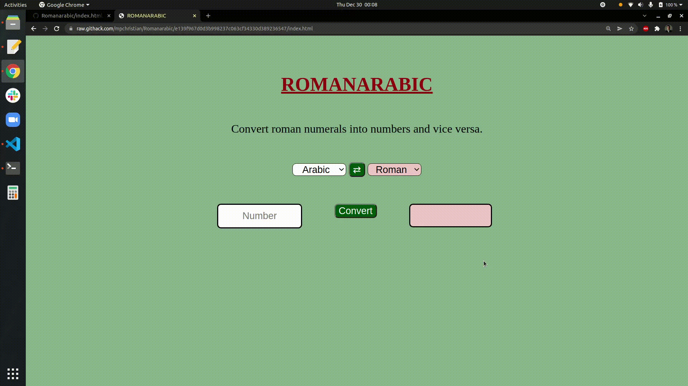

# Romanarabic
Este projeto utiliza os fundamentos de desenvolvimento web para
converter algarismos arábicos (decimais) em romanos
e vice-versa. O usuário seleciona o tipo de conversão que deseja e digita
os algarismos no campo apropriado. É explorado
o desenvolvimento e uso de algoritmos recursivos.

## Demonstração



## Tecnologias

HTML, CSS, JavaScript


## Rodando localmente

Clone o projeto

```bash
  git clone git@github.com:mpchristian/Romanarabic.git
```

Entre no diretório do projeto

```bash
  cd Romanarabic
```

Abra o arquivo `index.html` com seu navegador. Caso utilize o Google Chrome,
basta utilizar o comando

```bash
  google-chrome index.html
```

## Feedback

Se você tiver algum feedback, por favor envie para christianp3m@gmail.com